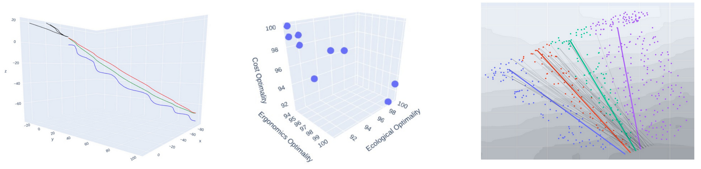
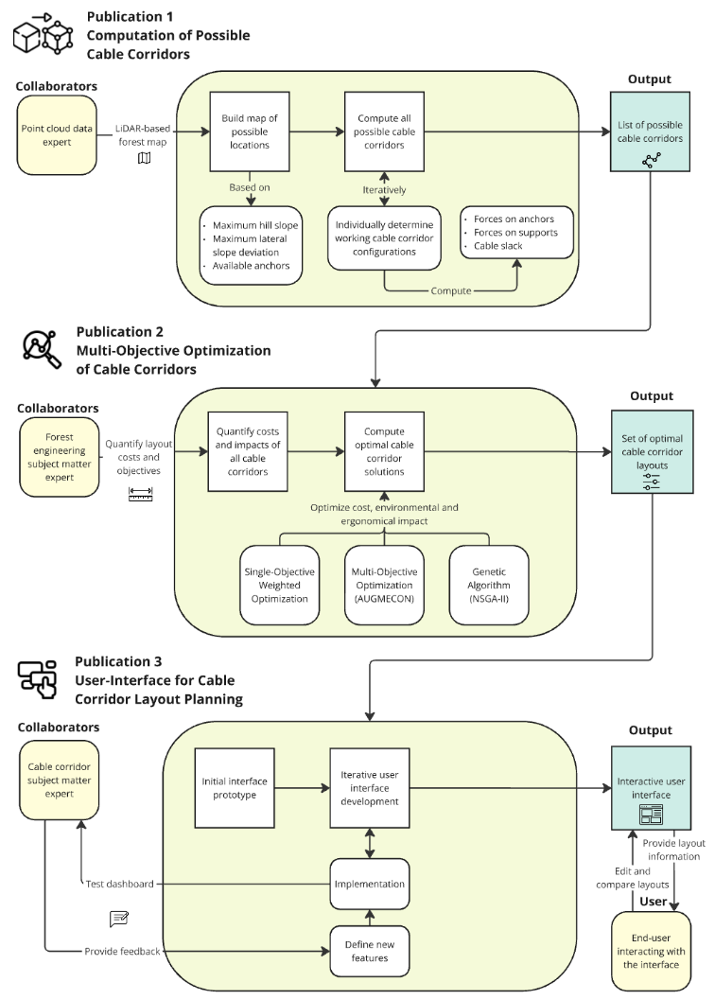

# Optimization of Cable-Road Layouts in Smart Forestry



Advanced multi-objective planning tools for designing cable-road corridors that balance productivity, ergonomics, and ecological impact in steep-terrain forestry. It provides a tool for simulating, optimizing, and indivudally adjusting cable corridor layouts.

## Overview

This repository accompanies the dissertation *LiDAR-based Multi-Objective Optimization for Cable Yarding in Steep Terrain*. It combines high-resolution terrain data, geometric reasoning, and evolutionary optimization to automatically generate feasible cable-road networks. The toolkit supports researchers and practitioners who need to explore trade-offs between harvesting efficiency and environmental stewardship. See the figure below of an overview of how the components of the dissertation fit together:



### Key Capabilities

- Generates feasible cable-road candidates through detailed geometric and mechanical checks.
- Optimizes corridor selections with single- and multi-objective approaches (AUGMECON, NSGA-II, manual weighting).
- Computes cost, ergonomic, and ecological indicators for each layout to quantify trade-offs.
- Provides interactive 2D/3D visualizations for inspecting cable corridors, anchor trees, and yarding distances.

## Repository Layout

- `src/main` – Core Python modules for geometric computation, mechanical analysis, optimization routines, and plotting utilities.
- `01_Notebooks` – Guided notebooks for preprocessing, optimization experiments, and interactive dashboards (`compute_cable_corridors.ipynb`, `optimization.ipynb`, `interface.ipynb`).
- `02_Figures` – Figures, GIFs, and interactive assets used in publications and presentations.
- `requirements.txt` – Python dependencies for both notebooks and scripts.

## Getting Started

1. Create and activate a virtual environment (Python ≥ 3.10 recommended).
   ```bash
   python -m venv .venv
   source .venv/bin/activate
   pip install --upgrade pip
   ```
2. Install project dependencies.
   ```bash
   pip install -r requirements.txt
   ```
3. Verify the installation by running unit tests or opening a notebook (see below).

## Typical Workflow

1. **Prepare data** – The high-resolution forest datasets used in the dissertation are not bundled. Reach out if you need access for research use, or substitute your own GeoPackage/GeoJSON files following the structures in `src/main/data_loading.py`.
2. **Generate cable-road candidates** – Use `src/main/cable_road_computation_main.py` or the `compute_cable_corridors.ipynb` notebook to enumerate geometrically valid corridors and support trees.
3. **Run optimization** – Explore AUGMECON and NSGA-II Pareto fronts via `src/main/optimization_execution.py` or `optimization.ipynb`, adjusting objectives and constraints as needed.
4. **Inspect results** – Launch `interface.ipynb` to interactively filter Pareto-optimal corridors and visualize anchor configurations in 3D.

## Notebooks for Exploration

- `compute_cable_corridors.ipynb` – End-to-end generation of cable road candidates with inline visual checks.
- `optimization.ipynb` – Multi-objective optimization workflows and Pareto front analysis.
- `interface.ipynb` – Plotly-based interactive selection and inspection of feasible corridor sets.
- `debugging_and_visualization.ipynb` – Utility plots for diagnosing mechanical checks and spatial filters.

## Data & Reproducibility

The repository does not ship with proprietary forest maps or LiDAR-derived height models. To reproduce the dissertation results:

- Request access to the original datasets, or adapt your own spatial layers to match the expected schema (see `src/main/classes_cable_road_computation.py`).
- Update the data paths referenced in notebooks and scripts to point to your local copies.
- Re-run the notebooks to regenerate optimization results and figures.

## Citation

If you build on this work, please cite the project using the metadata in `CITATION.cff`.

---

Questions, collaboration ideas, or data access requests are welcome—feel free to open an issue or reach out directly.
